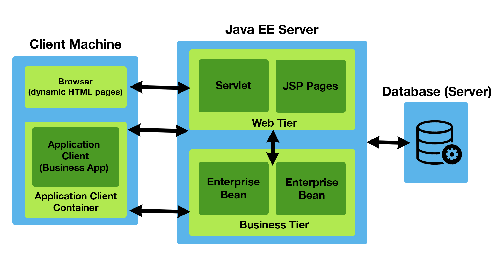
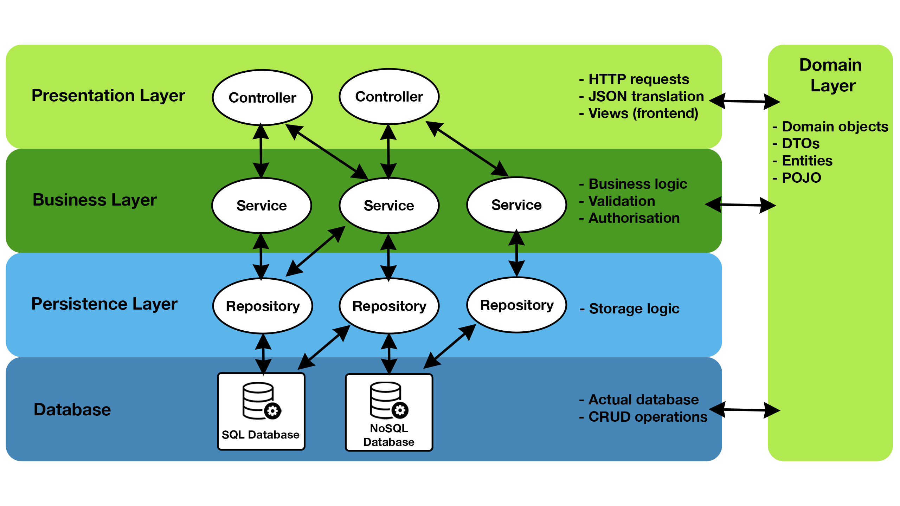

[section]
== Vergleich des Java EE Standard-Frameworks im Vergleich zu Spring zur Entwicklung von Business Applications

Paul MAUROVICH <mau18259@spengergasse.at>

:toc:

== Abstract
In diesem Paper werden die zwei (Web) Frameworks, Java EE und Spring, auf unterschiedliche Kriterien, wie Regelmäßigkeit von Updates, langfristiger Support, Kosten sowie Eleganz beim Programmieren, Funktionen und Querschnittsfunktion wie Logging, Wartbarkeit sowie die Developer Codebase untersucht. Die aus den Kriterien resultierenden Vor- und Nachteilen werden gegenübergestellt und bewertet.
Um die Arbeit angemessen zu verstehen, werden fortgeschrittene Fähigkeiten und Erfahrung in Informatik bzw. Programmiersprachen vorausgesetzt. Das Paper dient als Basis einer Entscheidungsgrundlage der zu wählenden Architektur für Business Applikationen.

<<<

== Einleitung
Java Entwickler und Java Entwicklerinnen stehen, sei es im Projekt für einen Kunden oder privat, für die Entwicklung von Business Applikationen vor der Entscheidung, welches (Web-)Framework sie für ihr Projekt wählen wollen. Sei es Hibernate, Spring, Apache Wicket, Grails oder Java EE bzw. Jakarta EE, für solch ein Projekt stehen viele Frameworks zur Verfügung. So macht es die Entscheidung schwer, welches Framework zu wählen ist und welches am besten für das Projekt passt. Hierfür wird in diesem Paper auf  die zwei Frameworks Spring und Java EE, speziell auf die Entwicklung von Business Applikationen und Web Lösungen, eingegangen.

Wichtig zu beachten ist, dass es kein “das beste Framework” für die Entwicklung *spezieller* Lösungen gibt, denn es kommt immer ganz darauf an, was die Business-Lösung können und welche Rahmenbedingungen wie Kosten oder Entwicklungsstandards es erfüllen soll – Softwarelösungen sind speziell.

== Get Started

== Java EE Framework
Java Enterprise Edition, kurz Java EE, früher auch J2EE genannt, ist ein Framework, ausgelegt für mittel bis große Projekte, welches es ermöglicht, umfassende und meist komplizierte (Unternehmens)Anwendungen zu entwickeln. Vor allem für Webanwendungslösungen im Unternehmensbereich, meist in Kombination mit REST Schnittstellen, und verteiltes Computing kommt Java EE häufig zum Einsatz. Das Framework baut auf Java SE (Standard Edition) auf und wird mit Microservice- oder Monolithen Architektur entwickelt. Das Framework wurde seit Java EE 8 auf Jakarta EE 8 umbenannt und Augenmerk auf Cloud Migration gelegt. Java EE baut auf die Verwendung von der objektorientierten Programmiersprache Java.

Benutzt wird es hauptsächlich zur Entwicklung von browserbasierten Web- und Enterprise (Business) Applikationen und bietet zahlreiche Spezifikationen wie

* *Servlets - WebServlets*: Handhabung von Web Anfragen und Antworten
* *Java API*: RESTful Webservices
* *JPA und JMS*: Datenbank Verbindungen und Datenbank Transaktionen
* *Bean Validation*: Deklariert eindeutige Constraints über eine Methode, ein Feld oder einer Klasse einer JavaBeans-Komponente
* *Uvm.*

Eine grundlegende Java EE Architektur könnte wie folgt aussehen:

Es besteht aus drei Hauptkomponenten. Die “Client Machine” ist das Endgerät: Browser und/oder die Business-Applikation. Diese hat Verbindungen zum zweiten Teil, dem Java EE Server, welcher über ein Web Container, mit dem Web Servlet sowie den JSP Pages , diese sind Jakarta Server Pages, welches es ermöglichen, Java Code in HTML- oder XML-Seiten einzubetten, und dem Business Container, wo die Enterprise Beans sind. Der Server ist mit einer Datenbank bzw. einem Datenbank-Server verbunden, worüber Datenbanktransaktionen durchgeführt werden können. Transaktionen können mit zum Beispiel einer REST-API durchgeführt werden.

== Spring Framework
Das Spring Framework ist eine Art Erweiterung, von der Java EE Platform ausgehend, für die Entwicklung von Java Applikationen im Hinblick auf Web Services und REST Schnittstellen. Hauptaugenmerk liegt auf die Entwicklung von Applikationen Business Logik, ohne viel Konfiguration von der Umgebung sowie Spezifikationen.

Spring (Boot) kommt mit einem automatisch konfigurierten Anwendungskontext sowie einem Web Server, um den Einstieg zu erleichtern und aufwendiges Aufsetzen des Frameworks zu unterbinden. Wohingegen Java EE nur mit der Programmiersprache Java läuft, so braucht Spring keine spezifische Sprache, doch meist wird Java oder Kotlin verwendet.

Der Schwerpunkt von Spring (Boot) liegt auf der Entwicklung von und mit Microservices. Es ist daraus ausgelegt und verfügt, wie auch Java EE, über einige Module:

* *Datenbank Zugang, Daten Integrität*: JDBC, JMS, ORM, OXM
* *Web*: Servelts, WebSockets, Portlet
* *Core Container*: Beans, Core, Context und SpEL

Eine Spring Boot Web Applikation Architektur sieht wie folgt aus:

Die Spring Boot Framework Architektur besteht aus vier Teilen. Die “Presentation Layer” Ebene, welche sich zum Beispiel um eingehende und ausgehende HTTP Requests/Response kümmert. Sie übersetzt die Daten von und zu JSON Objekten, um den Umgang mit der Applikationen zu gewährleisten. Grundsätzlich ist sie mit einer Front-End HTML oder XML Seite verbunden.

Die “Business Logic” Ebene beinhaltet die Services, welche mit Business Logik ausgestattet sind. Die eingehenden Daten werden in die Ebene transferiert und werden dort validiert bzw. autorisiert. Um Daten abzugleichen und welche Speicher Lösungen gewählt wurden, um das geht es bei der “Persistence Layer” Ebene. Sie verfügt über mehrere Repositorien, welche Datenbankzugriffe festlegen bzw. meist ein geeignetes SQL-Skript im Hintergrund ausführen.

Schlussendlich werden die Daten zum Beispiel in SQL, H2 oder PostgreSQL Datenbanken gespeichert und dort zugänglich gemacht. Die “Persistence Layer” Ebene führt mit der “Database Layer” Ebene “CRUD” (Create, Read, Update und Delete) Operationen durch, welche das Hinzufügen, Lesen, Aktualisieren und Löschen von Daten bereitstellt.

== Get Started

== Regelmäßige Updates
Java EE, seit Java EE 8 umbenannt auf Jakarta EE, erhält regelmäßig neue Version Updates. Die Frequentierung der Stable Updates ist durchschnittlich alle zwei bis vier Jahre und enthält meist neue Features und Verbesserungen. Das letzte Hauptupdate (Jakarta EE 9) war im Jahr 2020.
Das Spring Framework wird kontinuierlich aktualisiert. Das letzte große Update war 2017 mit Spring 5.0 und als letzter Stabel Release gilt Spring 5.3.4, welches im Februar 2021 veröffentlich wurde. Beide Frameworks erhalten regelmäßig Updates, wohingegen das Spring Framework öfter Updates bekommt als Java EE. Dies ist wohl auch der stetig expandierenden Nutzerbasis von Spring geschuldet. Auch Dependencies werden seitens beider Frameworks im Laufe von Updates mit aktualisiert.

Durch Dependency Injection und Cloud Migarion seitens beider Frameworks, bei Spring ist es Spring Boot, ist eine gute Wartbarkeit gegeben. Spring Boot verfügt über Plain Old Java Objects (POJO), welche sich durch kleine und “leichtgewichtige” Klassen auszeichnet, ermögtlich eine präzise Wartbarkeit, da jegliche Logik in kleinen Klassen leicht erreichbar und nicht zu umfassend versteckt ist. Auch Jave EE verfügt über Dependencies, welche einfach aktualsiert werden können.
Bei der Wartbarkeit beider Frameworks kommt es vor allem darauf an, ob eine Monolithen- oder Microservice Architektur gewählt wurde. Letzteres bietet einen weitausgehenden wartbareraren Code, da der Code je nach Spezifikationen in verschiedene Module aufgeteilt ist. Hunderte Klassen in einem Package, unübersichtliche Klassennamen und hunderzeilige Klasse mit Code sind hauptverantwortlich für schlechte Wartbarkeit.

Durch immer neue Updates und deren neuen Funktionen und Verbesserungen wird die Wartbarkeit immer besser, sei es mit der Cloud Migration von Jave EE 8 oder Spring Boot, beide wurden auf den heutigen Stand der Technik gehoben.

== langfristiger Support
Wie bereits im vorhergehenden Kapitel eingegangen, erhalten beide Frameworks regelmäßig Updates. Jedoch wirkt seit 2017 Oracle, der damalige Leiter von der Java Enterprise Platform, nicht mehr an der Entwicklung von Java EE mitwirken und hat die Leitung abgegeben. Dies zeigt auf, dass Java EE immer weniger an Relevanz in der heutigen Software Gemeinschaft hat und einen langfristigen Support fragwürdig macht. Zwar kann man noch mit einigen Updates in der Zukunft rechnen, doch bahnbrechende Updates werden auf sich warten lassen. Die Website “JRebel” hat einige Entwickler gefragt, ob und wenn sie von Jave EE zu Spring migriert hätten. Der Report ergab, dass lediglich 14% von Spring zu Java EE gewechselt haben bzw. es tun möchten, wohingegen 36% eher von Jave EE zu Spring migriert haben bzw. es tun möchten.

Viele Portale sprechen von dem Tod von Java EE, nachdem Oracle die Leitung abgegeben hat.
“Negotiations Failed: How Oracle killed Java EE”, so der Autor Markus Krag. In dem Bericht geht hervor, dass es einen Markenstreit zwischen Oracle und der Eclipse Foundation gab, welcher in keiner Einigung resultierte.

Seitens des Spring (Boot) Frameworks gibt es keine Anzeichen eines nahestehenden Endes. Unter der Leitung der Apache Foundation gewinnt das Framework immer mehr und mehr an Interesse und Nutzung unter der Entwicklergemeinschaft. Nicht nur sind große skalierbare Projekt mit dem Framework möglich, auch regelmäßige stabile Versionen kommen auf den Markt.

== Kosten, Eleganz beim Programmieren
// Programmier-Paradigmen, depe. inj., reactive Unterstützung

== Funktionen
// 1. Spring Funktionen, Features etc.
// Fasst Provider zusammen
// 2. Java EE Funktionen, Features etc.
// --> Welche Standards?

== Developer Codebase + Community Größe
// Wie groß ist Community, Stackoverflow, Aktualität etc.

== Querschnittsfunktion wie Security, Logging, Metriken
== Vorteile/Nachteile Java EE
// Tabelle PRO Contra

== Vorteile/Nachteile Spring Framework
// Tabelle PRO Contra

== Wann was verwenden? (Entscheidungskriterien)
== Unterschied Tabelle zwischen beiden
// USPs von beiden

== Verwendung von Spring Boot im Diplomprojekt
Im Diplomprojekt “ScanBuyGo” wurde als Framework auf die Verwendung von Spring Boot gesetzt.

Grund dafür war, dass bereits viel Erfahrung und praktische Programmierung Fähigkeiten in der Schule erlernt wurden und so eine Programmierung mit dem Framework leicht fiel. In Kombination mit der Programmiersprache Kotlin und dem “Build Management Tool” Gradle wurde eine RESTful API Lösung für das Projekt erstellt. Hauptaugenmerk lag auf der Verwendung von Microservices statt einer Monolithen-Architektur, um einzelne Module unabhängiger und einzel startfähig zu machen.

# Vorschläge: Skalierbarkeit, Wie gut ist es dokumentiert, Lizenz, Features

== Sources
https://hackr.io/blog/java-frameworks, abgerufen am 29.03.2021.

https://geekflare.com/de/java-ee-frameworks/#:~:text=Java%20EE%2DFrameworks%20(Enterprise%20Edition,Erstellen%20komplizierter%20und%20umfassender%20Unternehmensanwendungen.&text=Auf%20dem%20Markt%20gibt%20es,denen%20Webanwendungen%20erstellt%20werden%20k%C3%B6nnen., abgerufen am 29.03.2021.

https://www.javatpoint.com/java-ee#:~:text=The%20Java%20EE%20stands%20for,distributed%20computing%20and%20web%20services., abgerufen am 29.03.2021.

https://spring.io/projects/spring-framework, abgerufen am 29.03.2021.

https://spring.io/why-spring, abgerufen am 29.03.2021.

https://en.wikipedia.org/wiki/Jakarta_EE, abgerufen am 29.03.2021.

https://www.oreilly.com/library/view/java-ee-6/9781449338329/ch01.html, abgerufen am 29.03.2021.

https://docs.spring.io/spring-framework/docs/4.3.20.RELEASE/spring-framework-reference/html/overview.html, abgerufen am 29.03.2021.

https://www.javatpoint.com/spring-boot-architecture, abgerufen am 29.03.2021.

https://headcrashing.wordpress.com/2019/05/03/negotiations-failed-how-oracle-killed-java-ee/, abgerufen am 29.03.2021.

https://www.jrebel.com/blog/java-ee-vs-spring, abgerufen am 29.03.2021.

URL, abgerufen am 29.03.2021.

Bilder:

https://www.flaticon.com/, abgerufen am 29.03.2021.

http://pawlan.com/monica/articles/j2eearch/art/container1.jpg, abgerufen am 29.03.2021.

URL, abgerufen am 29.03.2021.

URL, abgerufen am 29.03.2021.

URL, abgerufen am 29.03.2021.

URL, abgerufen am 29.03.2021.

URL, abgerufen am 29.03.2021.

URL, abgerufen am 29.03.2021.

URL, abgerufen am 29.03.2021.

URL, abgerufen am 29.03.2021.

URL, abgerufen am 29.03.2021.

URL, abgerufen am 29.03.2021.

URL, abgerufen am 29.03.2021.

URL, abgerufen am 29.03.2021.

URL, abgerufen am 29.03.2021.

URL, abgerufen am 29.03.2021.

URL, abgerufen am 29.03.2021.

URL, abgerufen am 29.03.2021.

URL, abgerufen am 29.03.2021.
